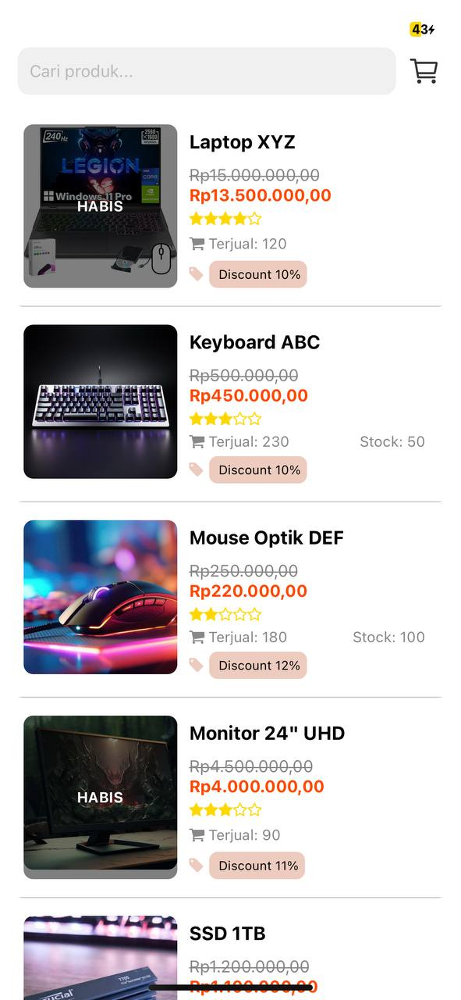

# 📦 PCPedia - Computer & Laptop Hardware Marketplace

**PCPedia** is a mobile marketplace application built with React Native and Expo, designed to sell various computer and laptop hardware components. The app offers a modern, lightweight, and responsive interface, delivering a user experience similar to popular marketplace platforms.

## 🎯 Key Features

* **Elegant Splash Screen** with logo and app introduction
* **Product List** with visually appealing product cards
* **Product Details** with image, original & discounted prices, rating, and stock
* **Shopping Cart**:

  * Add products to cart (local storage)
  * Swipe to delete items
  * Checkbox for selecting items
  * Dynamic total price based on selected items
* **Product Search** for quick navigation
* **Checkout Page**:

  * Summary of selected products
  * Shipping address information
  * Multiple payment methods (Credit Card, COD, Digital Wallet)

## 🛠 Technology Stack

* **React Native + Expo** (JavaScript)
* **AsyncStorage** for cart persistence
* **React Navigation** for page transitions
* **Icons** from Ionicons & FontAwesome
* **Swipeable** from react-native-gesture-handler

## 🧪 Dummy Data

All product data is static (array of objects) containing product details, pricing, discounts, and stock.

## 🖼️ Design & UX

* Color palette: `#3D90D7`, `#7AC6D2`, `#B5FCCD`
* Focused on simplicity, readability, and a visually pleasant shopping experience

## 🚀 Usage

1. Start the project with `npx expo start`
2. Navigate from SplashScreen to the product list
3. View product details and add to cart
4. Open the cart to review and proceed to checkout

## 📌 Notes

* This project uses static data and local storage
* No backend/API or authentication is implemented yet

## 🔮 Future Improvements

* Backend integration (Node.js / Firebase / Supabase)
* User login/register functionality
* Real checkout and online payment support
* Order notifications and transaction history

---

Thank you for using **PCPedia**. 🚀

> Built for learning, technical exploration, and portfolio demonstration.
